# 🏗️ Architecture Guide & Flow Diagrams

## 📋 Architecture Overview

The Payment System API follows **Clean Architecture** principles with clear separation of concerns across four distinct layers. Each layer has specific responsibilities and dependency flow.

---

## 🏛️ Clean Architecture Layers

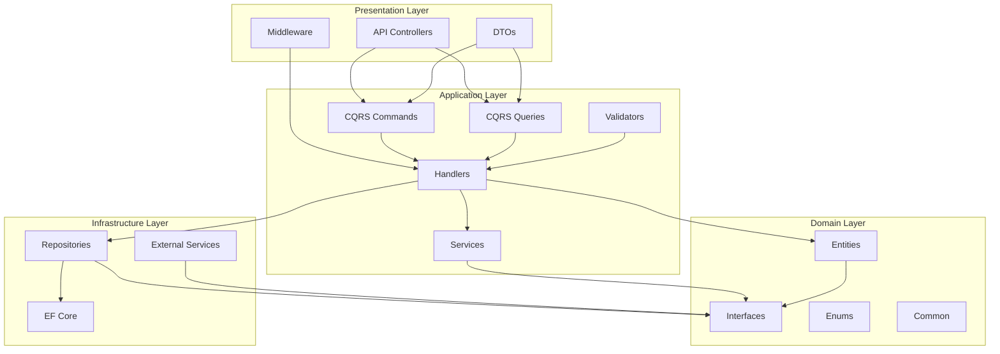

---

## 🔄 Request Flow Architecture

### Authentication Flow
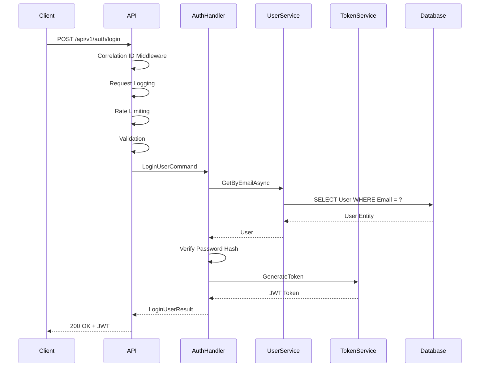

### Transaction Flow
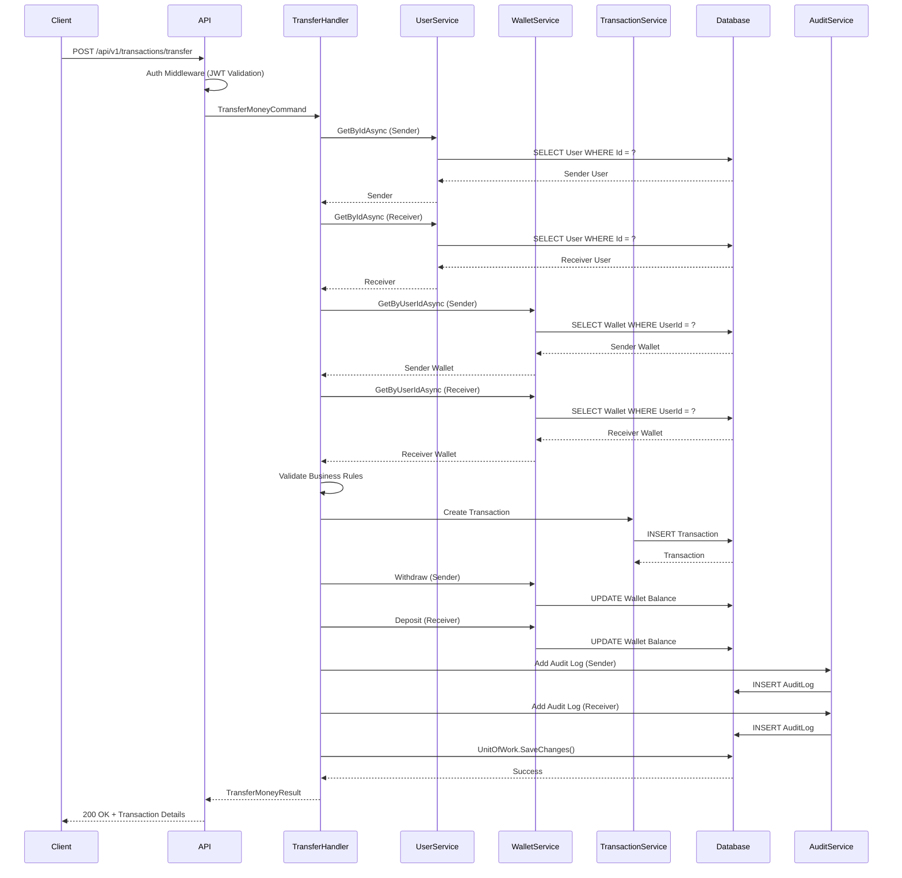

---

## 🏗️ Layer Responsibilities

### 🌐 API Layer (Presentation)
**Purpose**: HTTP request handling and response formatting

**Components**:
- **Controllers**: Thin endpoints using MediatR
- **Middleware**: Cross-cutting concerns (auth, logging, rate limiting)
- **DTOs**: Data transfer objects (no domain exposure)
- **Program.cs**: Application configuration and pipeline

**Key Rules**:
- No business logic
- Always use MediatR for operations
- Standardized response format
- Correlation ID propagation

### 🧠 Application Layer (Use Cases)
**Purpose**: Business logic orchestration and application services

**Components**:
- **Commands**: Write operations (Create, Update, Delete)
- **Queries**: Read operations (Get, List, Search)
- **Handlers**: Command/query processing logic
- **Validators**: Input validation rules
- **Services**: Application services (JWT, etc.)

**Key Rules**:
- CQRS pattern implementation
- Use repositories for data access
- Dependency inversion (depends on abstractions)
- Transaction management via Unit of Work

### 💎 Domain Layer (Business Rules)
**Purpose**: Core business entities and domain logic

**Components**:
- **Entities**: Business objects with behavior
- **Interfaces**: Repository contracts
- **Enums**: Domain-specific enumerations
- **Common**: Shared domain utilities

**Key Rules**:
- No external dependencies
- Rich domain models with behavior
- Domain invariants via guard clauses
- Pure business logic

### 🗄️ Infrastructure Layer (Data)
**Purpose**: Data persistence and external integrations

**Components**:
- **DbContext**: EF Core data access
- **Repositories**: Data access implementations
- **Migrations**: Database schema versioning
- **External Services**: Third-party integrations

**Key Rules**:
- Implements domain interfaces
- Framework-specific code only
- Database optimizations
- External service adapters

---

## 🔧 Dependency Flow

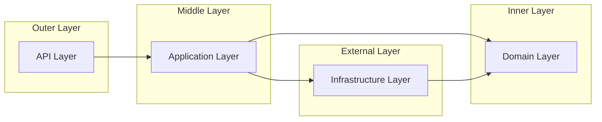

**Dependency Rules**:
- Dependencies point inward only
- API depends on Application
- Application depends on Domain and Infrastructure
- Infrastructure depends on Domain
- Domain has no dependencies

---

## 🗄️ Database Architecture

### Entity Relationship Diagram
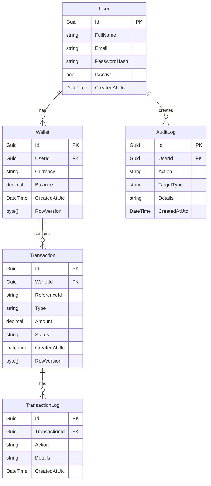

### Database Design Principles
- **Normalization**: 3NF with proper relationships
- **Concurrency**: RowVersion for optimistic concurrency
- **Indexing**: Strategic indexes for performance
- **Auditing**: Complete audit trail for compliance

---

## 🔐 Security Architecture

### Authentication Flow
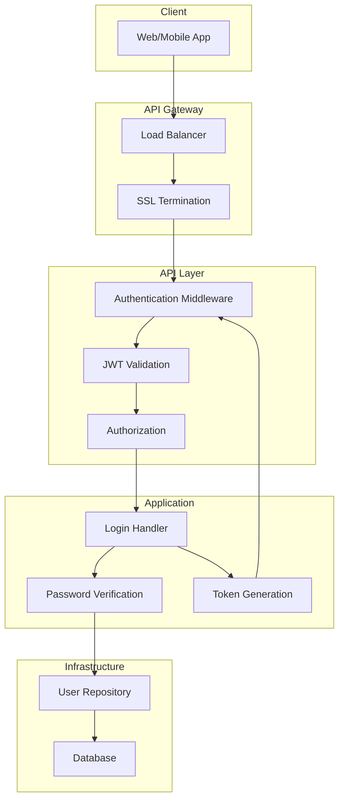

### Security Layers
1. **Network Layer**: SSL/TLS, Firewall rules
2. **API Layer**: Authentication, Authorization, Rate Limiting
3. **Application Layer**: Input validation, Business rules
4. **Data Layer**: Encryption, Access controls

---

## 📊 Performance Architecture

### Caching Strategy
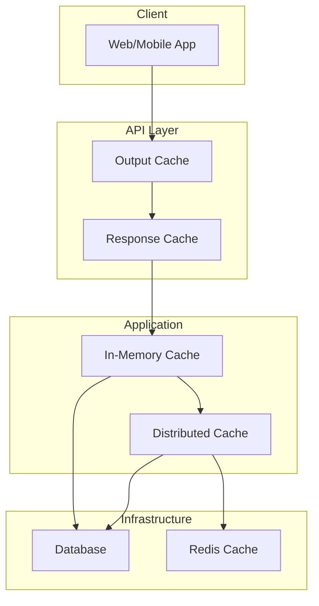

### Performance Optimizations
- **Database**: Connection pooling, query optimization
- **Caching**: Multi-level caching strategy
- **Async**: Non-blocking I/O throughout
- **Rate Limiting**: Prevent abuse and overload

---

## 🔄 Scalability Architecture

### Horizontal Scaling
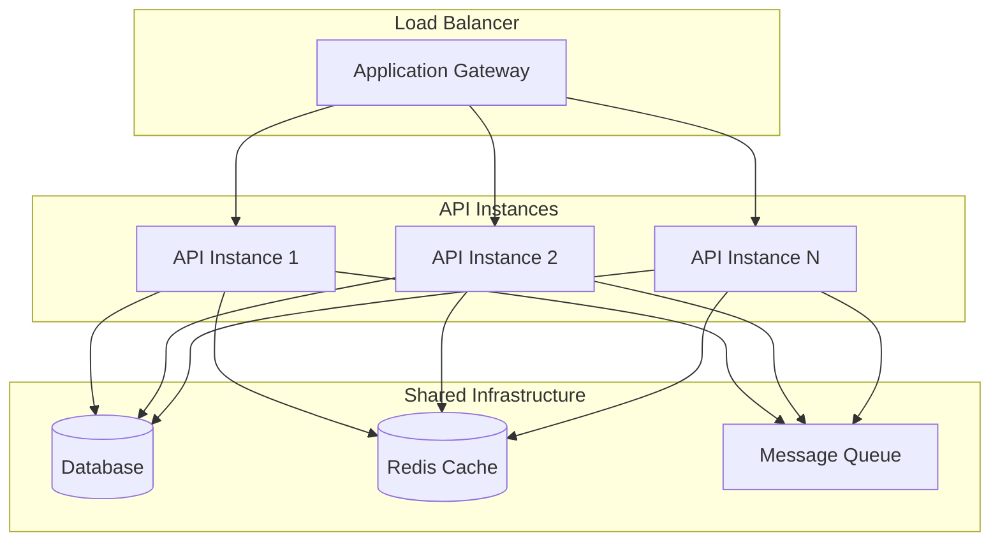

### Scaling Strategies
- **Stateless API**: Easy horizontal scaling
- **Database Sharding**: Distribute data load
- **Caching Layer**: Reduce database load
- **Message Queue**: Async processing for heavy operations

---

## 🧪 Testing Architecture

### Test Pyramid
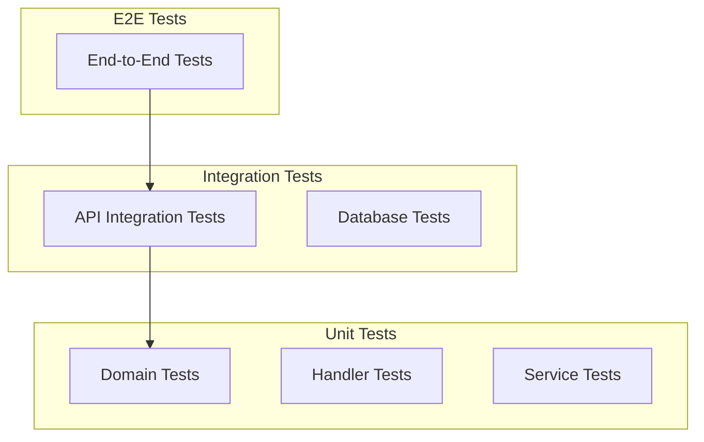

### Testing Strategy
- **Unit Tests**: Fast, isolated tests for business logic
- **Integration Tests**: Database and external service integration
- **E2E Tests**: Full request/response cycles
- **Performance Tests**: Load and stress testing

---

## 📝 Monitoring Architecture

### Observability Stack
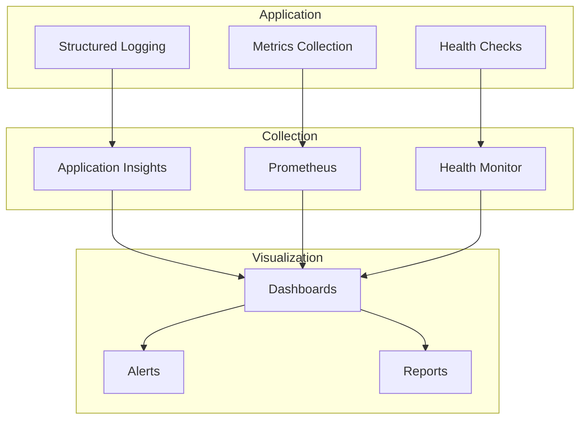

### Monitoring Components
- **Logging**: Structured logs with correlation IDs
- **Metrics**: Performance and business metrics
- **Health Checks**: Service availability monitoring
- **Alerting**: Proactive issue notification

---

## 🔧 Configuration Architecture

### Configuration Hierarchy
```mermaid
graph TB
    subgraph "Configuration Sources"
        A[appsettings.json]
        B[appsettings.{Environment}.json]
        C[Environment Variables]
        D[Azure Key Vault]
        E[Command Line Arguments]
    end
    
    subgraph "Configuration Provider"
        F[.NET Configuration]
    end
    
    subgraph "Application"
        G[IOptions<T>]
        H[Settings Classes]
    end
    
    A --> F
    B --> F
    C --> F
    D --> F
    E --> F
    
    F --> G
    G --> H
```

### Configuration Management
- **Development**: Local configuration files
- **Production**: Secure secret management
- **Environment-specific**: Override base settings
- **Runtime**: Hot reload where applicable

---

## 🚀 Deployment Architecture

### Container Deployment
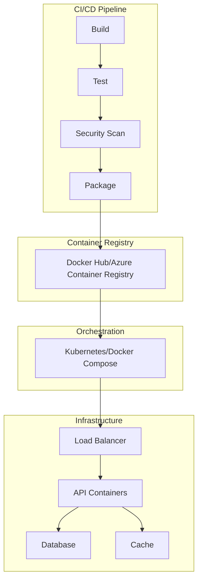

### Deployment Strategies
- **Blue-Green**: Zero-downtime deployments
- **Canary**: Gradual rollout with monitoring
- **Rolling**: Update instances incrementally
- **Rollback**: Quick revert capability

---

## 📚 Architecture Decision Records (ADRs)

### ADR-001: Clean Architecture Implementation
**Status**: Accepted
**Decision**: Implement Clean Architecture with clear layer separation
**Consequences**: 
- ✅ Maintainable codebase
- ✅ Testable components
- ✅ Flexible dependencies
- ❌ Increased complexity
- ❌ More boilerplate code

### ADR-002: CQRS Pattern
**Status**: Accepted
**Decision**: Use CQRS with MediatR for command/query separation
**Consequences**:
- ✅ Scalable read/write operations
- ✅ Clear intent separation
- ✅ Optimized queries
- ❌ Increased complexity
- ❌ More code to maintain

### ADR-003: JWT Authentication
**Status**: Accepted
**Decision**: Use JWT Bearer tokens for authentication
**Consequences**:
- ✅ Stateless authentication
- ✅ Cross-platform support
- ✅ Scalable solution
- ❌ Token revocation complexity
- ❌ Larger request headers

### ADR-004: Entity Framework Core
**Status**: Accepted
**Decision**: Use EF Core for data access
**Consequences**:
- ✅ Rapid development
- ✅ Database abstraction
- ✅ Migration support
- ❌ Performance overhead
- ❌ Limited control over SQL

---

## 🔄 Evolution Path

### Phase 1: Core Features ✅
- User authentication
- Basic wallet operations
- Simple transfers
- Audit logging

### Phase 2: Advanced Features 🚧
- Multi-currency support
- Transaction scheduling
- Advanced reporting
- Performance optimizations

### Phase 3: Enterprise Features 📋
- Microservices architecture
- Event sourcing
- CQRS with separate read models
- Advanced security features

### Phase 4: Scale & Optimization 📋
- Database sharding
- Distributed caching
- Global deployment
- AI-powered fraud detection

---

## 📋 Architecture Checklist

### Design Principles
- [ ] Single Responsibility Principle
- [ ] Open/Closed Principle
- [ ] Liskov Substitution Principle
- [ ] Interface Segregation Principle
- [ ] Dependency Inversion Principle

### Quality Attributes
- [ ] Performance requirements met
- [ ] Security measures implemented
- [ ] Scalability considerations
- [ ] Maintainability ensured
- [ ] Testability enabled
- [ ] Reliability guaranteed

### Documentation
- [ ] Architecture diagrams created
- [ ] Decision records maintained
- [ ] API documentation complete
- [ ] Deployment guides available
- [ ] Security practices documented

### Monitoring & Observability
- [ ] Logging strategy implemented
- [ ] Metrics collection configured
- [ ] Health checks enabled
- [ ] Alerting rules defined
- [ ] Performance monitoring active
